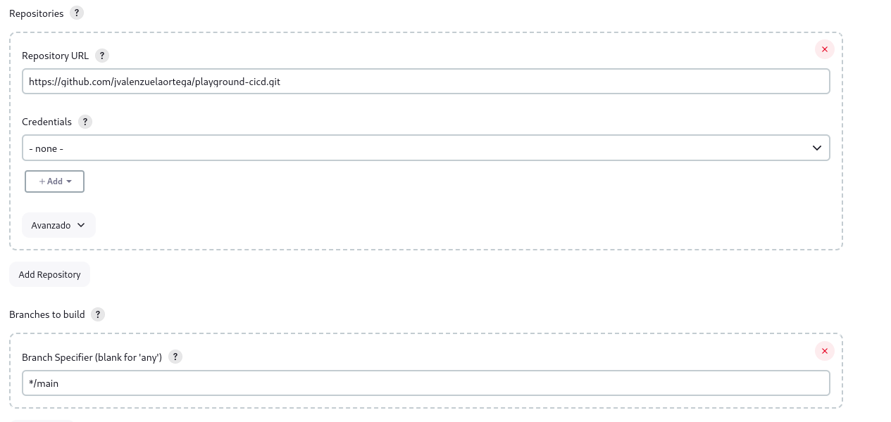
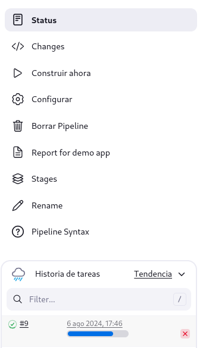
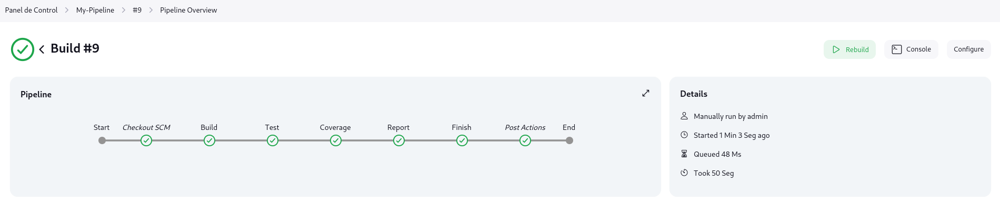

# Playgroud CI/CD

Testing application for CI CD integration with Jenkins

## Getting started 🚀

To test the project it is essential to have some tools

### Prerequisites 📋

```
Java 17
Maven 3.9.8
Git
Jenkins (War file or docker)
```

### Starting 🔧

To begin, you need to understand the file structure and the important files for execution.
When entering the demo folder, you will find the following files to consider:

- **Pom.xml**: contains the dependency configuration, the Jacoco library configuration plus the steps and Checkstyle pointing to the xml file in the resources folder.
- **Jenkinsfile**: Contains the configuration of steps required for the pipeline. It includes: Build, Tests, Checkstyle, Coverage and report.
- **Checkstyle**: Contains test configuration for java checkstyle
- **Dockerfile**: Contains the manifest to deploy the application using Docker.

### Development mode 🔨

- Create pipeline in Jenkins and point to the repository and branch indicated in the image:



- Execute a task and see the step-by-step process.



- Review and verify that there are no problems in any of the steps



## [Extra] Deploy with Docker

_In construction ..._

## Built with 🛠️

_Mention the tools used to create in this project_

* [Spring Boot](https://spring.io/projects/spring-boot) - Java framework
* [Maven](https://gradle.org/) - Dependency manager
* [Jenkins](https://www.jenkins.io/) - Open source automation server written in Java.

## Versioned 📌

_In construction ..._

## Authors ✒️

* **Juan Valenzuela** - *Base development* - [jvalenzuelaortega](https://github.com/jvalenzuelaortega)

